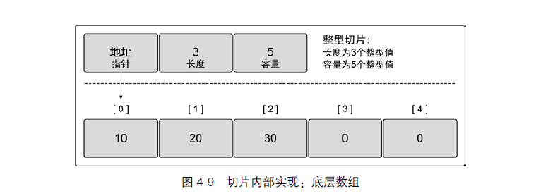

# go学习笔记


- [go学习笔记](#go学习笔记)
  - [1.go基本语法](#1go基本语法)
    - [(1)、声明方式](#1声明方式)
      - [1)、var声明方式](#1var声明方式)
      - [2)、const声明方式](#2const声明方式)
    - [（2)、go变量类型](#2go变量类型)
      - [1)、值类型](#1值类型)
      - [2)、指针类型](#2指针类型)
      - [3)、byte和rune类型](#3byte和rune类型)
      - [4)、修改字符串](#4修改字符串)
      - [5)、类型转换](#5类型转换)
      - [6)、数组](#6数组)
      - [7)、切片slice](#7切片slice)
        - [创建切片](#创建切片)
        - [slice底层原理](#slice底层原理)
        - [slice操作](#slice操作)
        - [通过make创建切片](#通过make创建切片)
        - [用append追加切片](#用append追加切片)
        - [超出原slice.cap限制，会重新分配底层数组，即使原数组并未填满](#超出原slicecap限制会重新分配底层数组即使原数组并未填满)
        - [切片扩容的规律](#切片扩容的规律)
        - [切片拷贝](#切片拷贝)
        - [slice遍历](#slice遍历)
        - [string底层就是一个byte的数组，可以进行切片操作](#string底层就是一个byte的数组可以进行切片操作)
    - [(3)、init函数和main函数](#3init函数和main函数)
    - [(4)、内置打印函数详解](#4内置打印函数详解)
    - [(5)、下划线](#5下划线)
    - [(6)、一些别的](#6一些别的)


## 1.go基本语法

### (1)、声明方式

```go
var--声明变量

const--声明常量

type--声明类型

func--声明函数
```

#### 1)、var声明方式

```go
var 变量名 变量类型
```

```go
//批量声明
var(
	a string
	b int
)
//简写 短变量声明
n:=2
```

#### 2)、const声明方式

```go
const a=1
const(
	a=1
    b=2
)

```

其中const中有一个iota常量计数器

```go
const(
    n1=iota//0
    n2	//1
    n3	//2
    n4	//3
)

//常用的iota实例
//使用_跳过某些值
const(
    n1=iota	//0
    _		//1
    n2		//2
)

//iota声明中间插队
const(
    n1=iota	//0
    n2=100
    n3=iota	//2
    n4		//3
)

const (
		n1 = iota//0
		n2 = 100
		n3		//100
		n4		//100
	)
```


### （2)、go变量类型

#### 1)、值类型

`bool、int、uint、float、string、complex(复数）、array（固定长度的数组）`

#### 2)、指针类型

```go
slice	--序列数组
map		--映射
chan	--管道
```

#### 3)、byte和rune类型

uint8类型，或者叫 byte 型，代表了ASCII码的一个字符。

rune类型，代表一个 UTF-8字符。

```go
// 遍历字符串
    func traversalString() {
        s := "pprof.cn博客"
        for i := 0; i < len(s); i++ { //byte
            fmt.Printf("%v(%c) ", s[i], s[i])
        }
        fmt.Println()
        for _, r := range s { //rune
            fmt.Printf("%v(%c) ", r, r)
        }
        fmt.Println()
    }
```

其输出如下

```go
 112(p) 112(p) 114(r) 111(o) 102(f) 46(.) 99(c) 110(n) 229(å) 141() 154() 229(å) 174(®) 162(¢)
    112(p) 112(p) 114(r) 111(o) 102(f) 46(.) 99(c) 110(n) 21338(博) 23458(客)
```

UTF8编码下一个中文汉字由`3~4`个字节组成，不能简单的按照字节去遍历一个包含中文的字符串，否则就会出现上面输出中第一行的结果。

字符串底层是一个byte数组，可以和[]byte类型相互转换。

字符串是不能修改的 字符串是由byte字节组成，所以字符串的长度是byte字节的长度。 rune类型用来表示utf8字符，一个rune字符由一个或多个byte组成。

#### 4)、修改字符串

要修改字符串，需要先将其转换为[]rune或者[]byte,完成后在转换为string。

每次都会重新分配内存，并复制字节数组

```go
func changeString() {
        s1 := "hello"
        // 强制类型转换
        byteS1 := []byte(s1)
        byteS1[0] = 'H'
        fmt.Println(string(byteS1))

        s2 := "博客"
        runeS2 := []rune(s2)
        runeS2[0] = '狗'
        fmt.Println(string(runeS2))
    }
```

#### 5)、类型转换

go语言只有强制类型转换，转换基本语法为：

```go
T（表达式）

var a float
var c int
c=int(a)
```

#### 6)、数组

数组定义，**数组长度一旦定义就不能更改**

```go
var a [len]int
```

多维数组

```go
var arr [len1][len2]int
```

1. **长度是数组类型的一部分，因此，var a[5] int和var a[10]int是不同的类型。**len()和cap()都可以得到数组长度
2. **数组是值类型，赋值和传参会复制整个数组而不是指针，改变副本的值不会改变本身的值。**
3. **数组进行值拷贝会造成性能问题，通常使用slice和数组指针。**
4. **支持“==”和“!=”操作符**

#### 7)、切片slice

##### 创建切片

```go
package main

import "fmt"

func main() {
   //1.声明切片
   var s1 []int
   if s1 == nil {
      fmt.Println("是空")
   } else {
      fmt.Println("不是空")
   }
   // 2.:=
   s2 := []int{}
   // 3.make()
   var s3 []int = make([]int, 0)
   fmt.Println(s1, s2, s3)
   // 4.初始化赋值
   var s4 []int = make([]int, 0, 0)
   fmt.Println(s4)
   s5 := []int{1, 2, 3}
   fmt.Println(s5)
   // 5.从数组切片
   arr := [5]int{1, 2, 3, 4, 5}
   var s6 []int
   // 前包后不包
   s6 = arr[1:4]
   fmt.Println(s6)
}
```

##### slice底层原理

**读写操作实际目标是底层数组**




```go
type Person struct {
  Name string
  Age  int
  Emails []string
}

func main() {
  p1 := Person{Name: "Alice", Age: 25, Emails: []string{"alice@example.com"}}
  p2 := p1
  p2.Emails[0] = "bob@example.com"
  fmt.Println(p1.Emails[0]) 
  fmt.Println(p2.Emails[0]) 
}
```

输出：

```go
bob@example.com
bob@example.com

```

**虽然是浅拷贝，但是email是一个切片，切片是引用类型，因此p1和p2共享相同的底层数组，对p2的修改也会影响到p1。**

**如果希望p2不会影响到p1,则需要先make在copy**

```go
func main() {
	p1 := Person{Name: "Alice", Age: 25, Emails: []string{"alice@example.com"}}

	// 显式复制切片内容创建一个新的切片
	p2 := Person{Name: p1.Name, Age: p1.Age, Emails: make([]string, len(p1.Emails))}
	copy(p2.Emails, p1.Emails)

	// 修改 p2 的 Emails 字段，不会影响到 p1
	p2.Emails[0] = "bob@example.com"

	// 输出 p1.Emails[0] 和 p2.Emails[0] 的值
	fmt.Println(p1.Emails[0]) // 输出 "alice@example.com"
	fmt.Println(p2.Emails[0]) // 输出 "bob@example.com"
}
```


##### slice操作

```go
len(s)	//获取切片的长度
cap(s)	//测量切片最长可以达到多少

package main

import "fmt"

func main() {
   var numbers = make([]int,3,5)

   printSlice(numbers)
}

func printSlice(x []int){
   fmt.Printf("len=%d cap=%d slice=%v\n",len(x),cap(x),x)
}
```

输出结果为：

```go
len=3 cap=5 slice=[0 0 0]
```

##### 通过make创建切片

```go
 var slice []type = make([]type, len)
    slice  := make([]type, len)//省略cap则默认cap=len
    slice  := make([]type, len, cap)
```

##### 用append追加切片

```go
package main

import(
	"fmt"
)

func main(){
    var a=[]int{1,2,3}
    fmt.Printf("slice a:%v\n",a)
    var b = []int{4, 5, 6}
    fmt.Printf("slice b : %v\n", b)
    c := append(a, b...)
    fmt.Printf("slice c : %v\n", c)
    d := append(c, 7)
    fmt.Printf("slice d : %v\n", d)
    e := append(d, 8, 9, 10)
    fmt.Printf("slice e : %v\n", e)
}
```

输出结果为：

```go
slice a : [1 2 3]
slice b : [4 5 6]
slice c : [1 2 3 4 5 6]
slice d : [1 2 3 4 5 6 7]
slice e : [1 2 3 4 5 6 7 8 9 10]
```

##### 超出原slice.cap限制，会重新分配底层数组，即使原数组并未填满

```go
package main

import (
    "fmt"
)

func main() {
//data是一个包含了11个整数的数组，浅5个元素是0、1、2、3、4,而第11个元素（索引为10）被设置为0,中间元素默认初始化为0
    data := [...]int{0, 1, 2, 3, 4, 10: 0}
    s := data[:2:3]

    s = append(s, 100, 200) // 一次 append 两个值，超出 s.cap 限制。

    fmt.Println(s, data)         // 重新分配底层数组，与原数组无关。
    fmt.Println(&s[0], &data[0]) // 比对底层数组起始指针。

}
```

其输出为：

```go
[0 1 100 200] [0 1 2 3 4 0 0 0 0 0 0]
0xc4200160f0 0xc420070060
```

append 后的 s 重新分配了底层数组，并复制数据。如果只追加一个值，则不会超过 s.cap 限制，也就不会重新分配。 通常以 2 倍容量重新分配底层数组。在大批量添加数据时，建议一次性分配足够大的空间，以减少内存分配和数据复制开销。或初始化足够长的 len 属性，改用索引号进行操作。及时释放不再使用的 slice 对象，避免持有过期数组，造成 GC 无法回收。

##### 切片扩容的规律

```go
package main

import (
    "fmt"
)

func main() {

    s := make([]int, 0, 1)
    c := cap(s)

    for i := 0; i < 50; i++ {
        s = append(s, i)
        if n := cap(s); n > c {
            fmt.Printf("cap: %d -> %d\n", c, n)
            c = n
        }
    }

}
```

输出为：

```go
cap: 1 -> 2
cap: 2 -> 4
cap: 4 -> 8
cap: 8 -> 16
cap: 16 -> 32
cap: 32 -> 64
```

**切片的容量在每次扩容时都会翻倍，go语言切片的扩容策略通常是以2的幂次方进行的。**

##### 切片拷贝

> copy ：函数 copy 在两个 slice 间复制数据，复制长度以 len 小的为准。两个 slice 可指向同一底层数组，允许元素区间重叠。

```go
package main

import (
    "fmt"
)

func main() {

    s1 := []int{1, 2, 3, 4, 5}
    fmt.Printf("slice s1 : %v\n", s1)
    s2 := make([]int, 10)
    fmt.Printf("slice s2 : %v\n", s2)
    copy(s2, s1)
    fmt.Printf("copied slice s1 : %v\n", s1)
    fmt.Printf("copied slice s2 : %v\n", s2)
    s3 := []int{1, 2, 3}
    fmt.Printf("slice s3 : %v\n", s3)
    s3 = append(s3, s2...)
    fmt.Printf("appended slice s3 : %v\n", s3)
    s3 = append(s3, 4, 5, 6)
    fmt.Printf("last slice s3 : %v\n", s3)

}
```

输出结果为：

```go
 slice s1 : [1 2 3 4 5]
    slice s2 : [0 0 0 0 0 0 0 0 0 0]
    copied slice s1 : [1 2 3 4 5]
    copied slice s2 : [1 2 3 4 5 0 0 0 0 0]
    slice s3 : [1 2 3]
    appended slice s3 : [1 2 3 1 2 3 4 5 0 0 0 0 0]
    last slice s3 : [1 2 3 1 2 3 4 5 0 0 0 0 0 4 5 6]
```

##### slice遍历

```go
package main

import (
    "fmt"
)

func main() {

    data := [...]int{0, 1, 2, 3, 4, 5, 6, 7, 8, 9}
    slice := data[:]
    for index, value := range slice {
        fmt.Printf("inde : %v , value : %v\n", index, value)
    }

}
```

##### string底层就是一个byte的数组，可以进行切片操作

```go
package main

import (
    "fmt"
)

func main() {
    str := "hello world"
    s1 := str[0:5]
    fmt.Println(s1)

    s2 := str[6:]
    fmt.Println(s2)
}

/*输出
hello
world
*/
```

改变string中的字符：

```go
package main

import (
    "fmt"
)

func main() {
    str := "Hello world"
    s := []byte(str) //中文字符需要用[]rune(str)
    s[6] = 'G'
    s = s[:8]
    s = append(s, '!')
    str = string(s)
    fmt.Println(str)
}
```

### (3)、init函数和main函数

**init函数：**

> init函数可以用于包的初始化，init函数不能被其他函数调用，在main函数之前自动被调用
>
> 每个包可以拥有多个init函数，每个源文件也可以拥有多个init函数，多个init函数执行顺序没有明确定义

**main函数：**

main函数是程序的入口

```go
func main(){
    
}
```

**main函数和init函数的异同：**

**相同点：**

- 在定义时都不能有任何的参数和返回值有程序自动调用

**不同点：**

- init可以应用于任意包中，main函数只能用于main包中
- init函数可以重复定义多个，main函数只能定义一个


### (4)、内置打印函数详解


**Printf函数:**

```go
          Printf(format string, v ...) (n int, errno os.Error)

```

其中"..."表示数目可变参数，和C语言中"stdarg.h"中的宏类似。不过Go中，可变参数是通道 一个空接口（"interface {}"）和反射（reflection）库实现的。

printf方法需要加参数表示后面打印的变量是什么，在go中最简单的方法是用"%v"标志，它可以以适当的格式输出任意的类型（包括数组和结构）。

**Print/Println函数：**

使用这两个函数甚至不需要格式化字符串，他两就相当于封装好的printf,会自动格式化

Print函数默认将每个参数以%v格式输出

Println函数则是在Print函数基础上增加一个换行符

### (5)、下划线

“_”是特殊标识符，用来忽略结果。

**在import中**

```go
import_ "./hello"	//代表仅仅调用了该包的init函数，无法通过包名调用里面其他函数
```

**在代码中**

在代码中是占位符，意思是那个位置本应赋给某个值，但是咱们不需要这个值。所以就把该值赋给下划线，意思是丢掉不要。

```go
 import "database/sql"
    import _ "github.com/go-sql-driver/mysql"
```


### (6)、一些别的

调用Println函数自动拥有换行符并且每个参数打印出来中间自带空格  Print函数并不自带换行符

go没有三目运算符

import导入多个应该为（）

